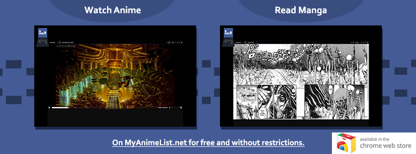
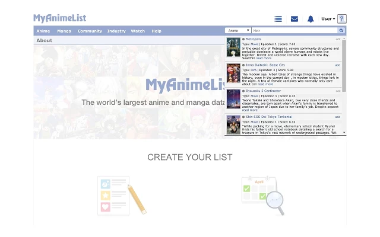
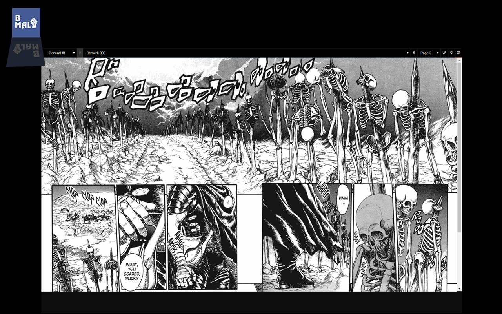
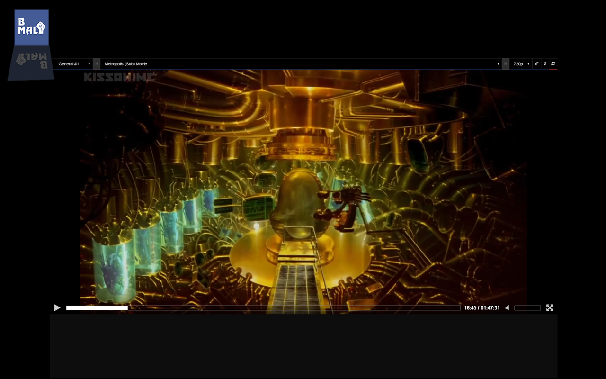

# bettermyanimelist

## Screenshots

# Deprecated project

This project died late 2016, the latest release was 2.5.56.

# Summary

- I. Introduction
- II. The BetterMyAnimeList project
- III. Features
- III.I. Autocomplete
- III.II. Streaming and reading
- IV. Specifications
	- IV.I. Titles matching system
- V. Plans
	- V.I. Abstract
	- V.II. The beta version
		- V.II.I. Introduction
		- V.II.II. Overview
		- V.II.III. The brand new MediaPlayer
	- V.III. The alpha version
		- V.III.I. Introduction
		- V.III.II. Overview
		- V.III.III. The sources engine
	- V.IV. The mobile version
	- V.IV.I. Introduction
- VI. Information
- VII. License
- VIII. Disclaimers

## Introduction

In brief, BetterMyAnimeList currently allows, among other things, to watch anime and read manga through MyAnimeList.net.
The extension only aims to provide rich, useful and non-existing features which purpose is to EXTEND to MyAnimeList.net
not to replace any existing feature in any way.
The ultime goal is to centralize all the mainstream features and databases around the anime world on a single platform,
which in our case happens to be MyAnimeList.net. Once this goal has been achieved the accessibility problems should be
addressed and small and/or other devices will have their pound of flesh.

## The BetterMyAnimeList project

The BetterMyAnimeList project includes:
- The trademark
- The extension
- The website
- Any piece of software, mechanism and logic associated with it

## Features

### The autocomplete

This is BetterMyAnimeList's raison de vivre, the autocomplete feature was the first feature ever added to BetterMyAnimeList
and it's purpose is to extend to the main search bar and provide you with the results of your search rendered in a great
and nice layout saving you a few clicks.

### Streaming and reading

Not so long after the autocomplete features was introduced the streaming came to life and a few weeks later the reading made
its appearance. Their purpose is not to provide a free alternative to other streaming and reading platforms
but to provide a centralized, easy and hassle-free way to enjoy anime and manga. All of this at the same place.

## Specifications

### Titles matching system

The titles matching system is the piece of software that makes the streaming and reading possible and which purpose
is to match the anime or manga provided titles with various streaming and reading platforms using a given search engine.
Once one of those titles has been matched it will then retrieve the episodes or chapters to finally render the media.

## Plans

### Abstract

The BetterMyAnimeList extension is undergoing a heavy recreation process which I already split in two distinct versions:
the beta and alpha version. These two versions will provide major changes for BetterMyAnimeList and you might want to
take a look at what is currently being done.

### The beta version

#### Introduction

The beta version alias the version 2.5.0

#### Overview

...

#### The brand new MediaPlayer

...

### The alpha version

#### Introduction

The alpha version alias the version 3.0.0

#### Overview

...

#### Sources engine

The sources engine is an ultra complex, abstract and useful system which behavior is somehow similar to a search engine
yet now to similar. It will soon become a key component to BetterMyAnimeList as it will serve as a bridge between the various
streaming and reading platforms as well as the databases. The source engines will aim to replace the titles matching system
and will do a much better job.

### The mobile version

#### Introduction

...

## Information

- Website: bettermyanimelist.net
- Chrome: https://chrome.google.com/webstore/detail/bettermyanimelist/ajgdjkblmldgbpnhmidonolhokollgfa
- Firefox: https://addons.mozilla.org/en-US/firefox/addon/bettermyanimelist/
- Support: support@bettermyanimelist.net
- Inquiries: admin@bettermyanimelist.net (business only)
- Facebook: facebook.com/bettermyanimelist
- Google+: +BettermyanimelistNet_ext
- Twitter: @BMAL_ext
- Paypal: donate@bettermyanimelist.net

## License

Copyright (C) BetterMyAnimeList, Co - All Rights Reserved
Unauthorized copying of any piece, idea or logic of this software, via any medium is strictly prohibited Proprietary and confidential.

## Disclaimers

MyAnimeList.net is a trademark of their respective owners and BetterMyAnimeList is neither associated
nor partnered with them in any way which means that your are installing this software at your own risk and
should not expect to get any support from them.
